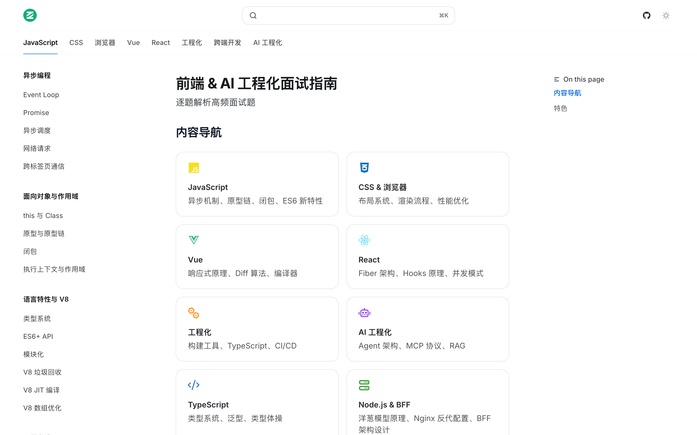
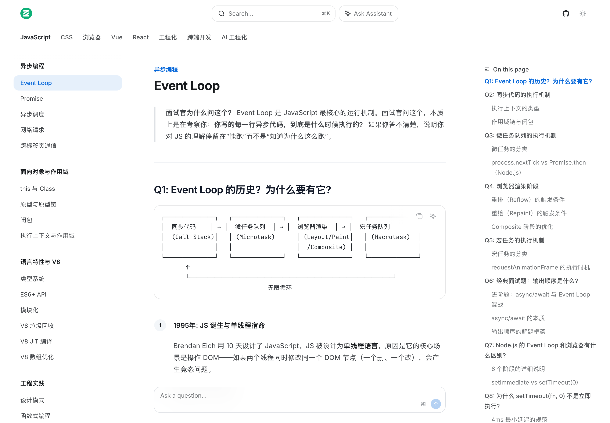

# Senior Frontend Interview Guide

👉 [在线阅读](https://opc-43d279b8.mintlify.app)

> 面向高级前端工程师的面试手册，讲底层原理，不讲 API 背诵。

 

---

## 为什么做这个

- 讲底层，不讲定义：不解释"闭包是什么"，解释"执行上下文与作用域链在 V8 中的内存布局"。
- 有出处：深度解析都溯源到具体专家（Dan Abramov、Harrison Chase 等）和大厂基建博客（Vercel、字节 Web Infra 等），不泛泛而谈。
- AI 工程化专区：LangChain 编排、Agent 状态快照、MCP 协议，不讲空概念，讲怎么落地。
- 支持 AI 检索：提供标准的 `[llms.txt](./llms.txt)`，Cursor、Claude 等工具可以直接读取。

---

## 知识结构

### JavaScript 与 V8 引擎

Event Loop 宏/微任务队列的底层 C++ 实现、执行上下文栈、闭包、原型链、Orinoco GC、Ignition/TurboFan JIT 编译、Hidden Class。

### 前端框架

React：Fiber 树遍历、Hooks 链表结构、Lane 模型并发调度。Vue：响应式依赖收集、Patch 与 Diff、模板预编译。

### 浏览器与网络

渲染流程（DOM → Style → Layout → Paint → Raster → Compositor，16.6ms 帧生命周期）、TCP 拥塞控制、HTTP/2 多路复用、HTTP/3 QUIC、0-RTT。

### 工程化

Webpack 依赖图与 Tapable 插件机制、Vite ESBuild/Rollup 双引擎、微前端沙箱隔离、Monorepo 远端缓存。

### AI 工程化

Prompt Engineering、RAG 架构、LangGraph 多智能体编排、长时运行 Agent 的异步恢复、MCP 协议。